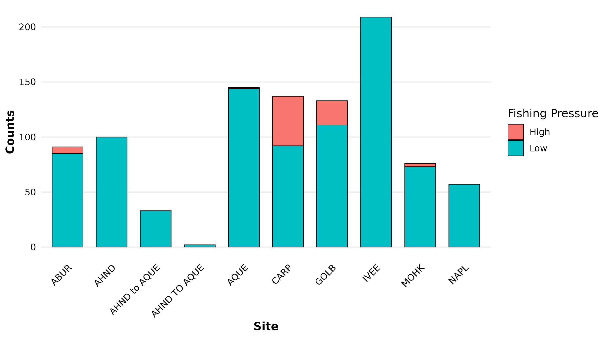

## Data

Data on abundance, size and fishing pressure of California spiny lobster (Panulirus interruptus) are collected along the mainland coast of the Santa Barbara Channel. Spiny lobsters are an important predator in giant kelp forests off southern California. [@lter2022]

```{r}
#| echo: false
#| warning: false
library(readr)
library(dplyr)
library(ggplot2)
library(tidyr)
library(here)
```

## When and where are lobsters found?
```{r}
lobster_abundance <- read_csv("../data/Lobster_Abundance_All_Years_20220829.csv")

lobster_clean <- lobster_abundance %>% 
  mutate(SIZE_MM = na_if(SIZE_MM, -99999))

lobster_summarize <- lobster_clean %>% 
  group_by(SITE, YEAR) %>% 
  summarize(COUNT = n()) ## what's this?? 

ggplot(data = lobster_summarize, aes(x = YEAR, y=COUNT, color=SITE)) + 
  geom_line() +
  geom_point()
```
## How big are the lobsters?
```{r}
lobster_size_lrg <- lobster_clean %>% 
  filter(YEAR %in% c("2019", "2020", "2021")) %>% 
  mutate(SIZE_BIN = if_else(SIZE_MM <= 70, "SMALL", "LARGE")) %>% 
  group_by(SIZE_BIN) %>% 
  summarize(COUNT = n()) %>% 
  drop_na()

ggplot(data=lobster_size_lrg, aes(x=SIZE_BIN, y = COUNT)) +
  geom_col(aes(fill=SIZE_BIN)) +
  labs(title = "Sizes of Lobsters", x = "Size", y = "Count") +
  theme_minimal() +
  theme(plot.background = element_rect(fill = "green"))

```

# Collaborator analysis

We looked at how fishing pressure were spread out over the different fishing locations


